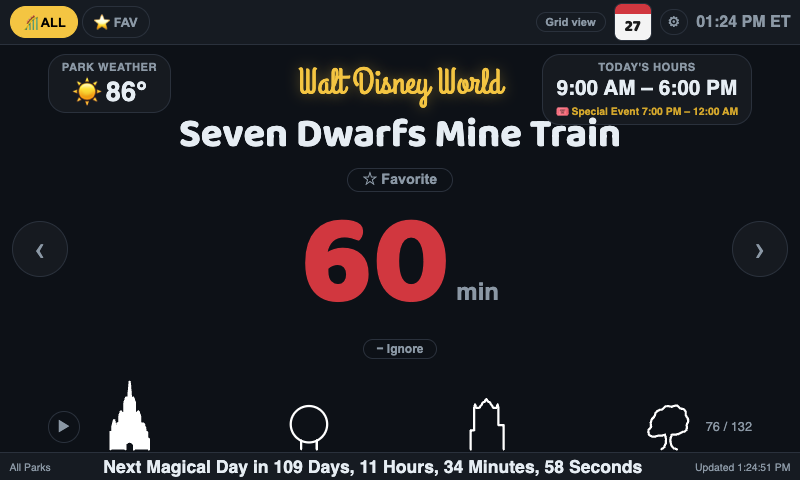
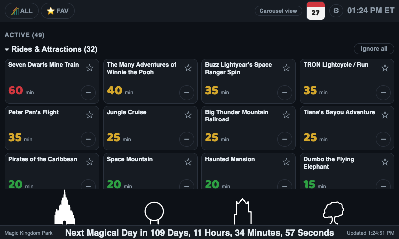
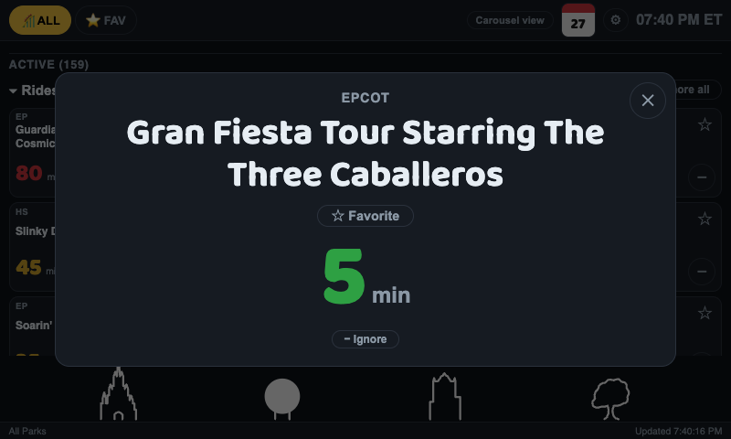
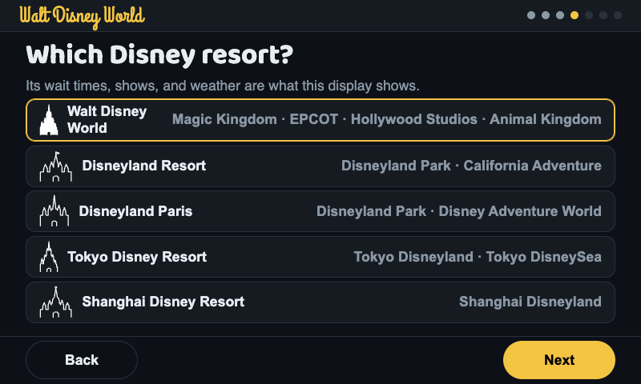
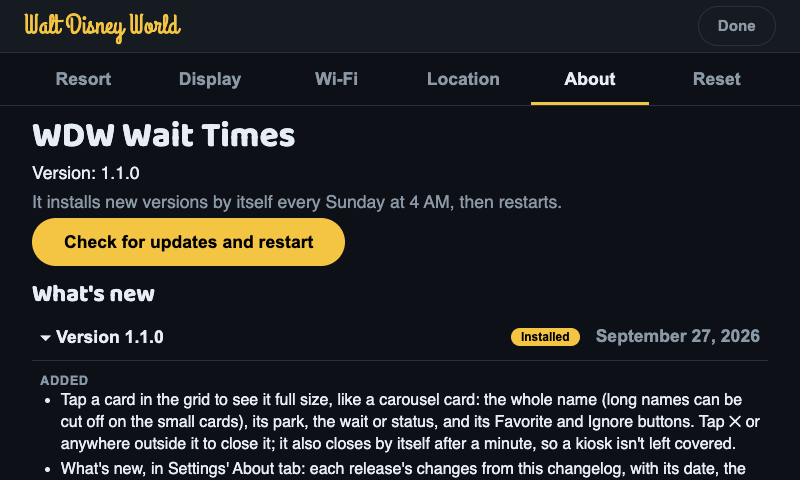

# Disney Parks Wait Times

A kiosk-style dashboard for Disney park wait times, built to run
full-screen on a Raspberry Pi with a small touchscreen. It's plain
HTML/CSS/JS with no build step. Live data comes straight from public APIs (no
API keys needed); the only local backend is a tiny Python server
(`server/server.py`) that serves the page and saves favorite rides.

It covers one Disney resort at a time, chosen in the
[setup wizard](#setup-wizard):

| Resort | Parks |
|---|---|
| Walt Disney World | Magic Kingdom, EPCOT, Hollywood Studios, Animal Kingdom |
| Disneyland Resort | Disneyland Park, California Adventure |
| Disneyland Paris | Disneyland Park, Disney Adventure World |
| Tokyo Disney Resort | Tokyo Disneyland, Tokyo DisneySea |
| Shanghai Disney Resort | Shanghai Disneyland |

Ride wait times and park hours refresh every 5 minutes; weather every 15.
Everything is shown in the resort's local time.

> This is an unofficial fan project. It isn't affiliated with, endorsed by, or
> sponsored by Disney. Park and attraction names are used only to identify the
> data shown.



## Features

### Choosing what to show

- **All Parks** (top-left tab) pools every open ride from all of the
  resort's parks.
- **Favorites** (next to it) shows only the rides you've starred.
- **A skyline of park landmarks** runs along the bottom, one per park (at
  Walt Disney World: Cinderella Castle, Spaceship Earth, the Tower of Terror,
  and the Tree of Life). Tap one to show
  just that park; tap it again to go back to All Parks. The selected park's
  landmark is filled in. On All Parks and Favorites, the carousel fills in the
  landmark of the park the current ride belongs to.

On startup, the app opens on Favorites if any rides at the chosen resort
are starred, otherwise on All Parks. Favorites and ignored items are kept
for every resort: switching resorts hides the other resort's picks, and
switching back brings them back.

### Two views

Toggle between them with the button in the top-right corner.



- **Carousel** (default): one ride at a time, with a big name and wait time,
  auto-advancing every ~4.5 seconds. Tap the arrows to move forward or back,
  or the round button to pause. On All Parks, rides are shuffled so the loop
  jumps between parks instead of finishing one park before starting the next.
- **Grid**: everything in the current selection at once, grouped (see
  [Grid groups](#grid-groups)). On All Parks and Favorites, each card is
  tagged with its park (e.g. "MK"). Tap a card to see it full size, like a
  carousel card, with its whole name (long names can be cut off in the
  grid) and its Favorite and Ignore buttons; tap ✕ or outside it to close
  it, or it closes by itself after a minute.



Each item shows one of:

- **its wait time**, in minutes;
- **Operating**: running, with no wait posted. This covers theater shows such as
  The Hall of Presidents, rides between wait-time updates, and exhibits and
  walk-throughs, which never have a wait;
- **Down**: temporarily not running;
- **Opens *time***: opening later today, such as a show that starts after the
  park opens;
- **Show *time*** (**Next *time*** for a meet-and-greet): the next
  performance or appearance today;
- **No more shows** (**No more today**): the last one today has passed;
- **Closed**: not open today (or under refurbishment).

Within each grid group, items are listed in that order (upcoming shows and
openings soonest first). The carousel shows items with a wait time, down
rides, items opening later today ("Opens at 11:45 AM"), shows and
meet-and-greets still to come ("Next show at 2:00 PM"), and "Operating"
rides, shows, and meet-and-greets. Exhibits and walk-throughs stay in the
grid so they don't crowd the rotation, unless you star one, which adds it to
the Favorites carousel.

### Grid groups

The grid is a vertical accordion. It has two sections, **Active** and
**Inactive** (items you've [ignored](#ignoring-items)), each split into
groups:

- **Rides & Attractions**: attractions with a standby line, including
  theater shows like The Hall of Presidents;
- **Shows**: parades, stage shows, fireworks, and anything else with
  scheduled performances (including The American Adventure);
- **Meet & Greets**: character appearances;
- **Exhibits & Walk-throughs**: attractions with no line, such as Cinderella
  Castle or EPCOT's galleries.

Tap a group's name to open or close it; Active groups start open and
Inactive ones closed, and each device remembers your choice. Each group has
an **Ignore all** (or **Activate all**) button. The data has no "ride",
"show", or "walk-through" type for attractions, so the app sorts them by
whether they have a standby line or a schedule of performances.

### Shows

Parades, stage shows, fireworks, meet-and-greets, and other entertainment
appear alongside the rides, with their next performance time. A show that
runs over a window rather than at set times (like a meet-and-greet from 9:00
to 5:00) shows a wait time, "Operating", or "Opens *time*", like a ride.
Everything with times for regular guests today is included; shows that only
perform for a separately ticketed event, like a Halloween party, are left
out. To hide any other show, such as background musicians,
[ignore it](#ignoring-items).

### Closed parks

When a park is closed, the carousel shows a "*Park* is closed. Opening
tomorrow at *time*" slide instead of its rides (on All Parks and Favorites,
one per closed park, mixed in with the other slides). A park can be closed to
regular guests while rides keep running for a separately ticketed evening
event, such as a Halloween party; while any of its rides are operating, those
rides show instead of the closed slide.

### Favorites

Tap the ☆ in a grid card's corner, or the "☆ Favorite" button on a carousel
slide, to add a ride; tap the filled ★ to remove it. Favorites are saved on
the device running `server.py`, in
`~/.local/share/disney-parks-wait-times/favorites.json` (set `DPWT_DATA_DIR` to change
the folder). Keeping them outside the project folder means they survive
reboots and updates.

### Ignoring items

Anything can be hidden: a ride, a show, or an exhibit. Tap the "−" in a grid
card's bottom corner, or the "− Ignore" button under a carousel slide, or
**Ignore all** on a grid group. An ignored item leaves the carousel and moves
to the grid's Inactive section, where its "+" (or the group's **Activate
all**) brings it back. Ignoring a group only affects what's in it now:
anything that appears later starts out active. Ignoring a favorite keeps it
starred; it's just hidden.

Like favorites, the ignored list is saved on the device running
`server.py`, in `~/.local/share/disney-parks-wait-times/ignored.json`, so each kiosk
keeps its own list across reboots and updates.

### Setup wizard

The first time the kiosk starts, it runs a setup wizard on the touchscreen,
with no keyboard, phone, or computer needed:




1. **Country.** This also sets the Wi-Fi region (Wi-Fi channels differ by
   country, so a Pi set to the wrong one may not see the router at all).
2. **Time zone**, if the country has more than one.
3. **Resort:** which Disney resort to show. It defaults to the local one in
   Japan, France, or China, Disneyland on the US West Coast, and otherwise
   Walt Disney World.
4. **Display:** °F or °C, and a 12- or 24-hour clock. Both default to what's
   usual in the chosen country, e.g. °C and 24-hour for Japan.
5. **Wi-Fi:** pick a network and type its password on the built-in keyboard.
   Networks it already knows are marked "Saved" and connect with one tap.
6. **Check for updates:** once it's online, it offers to get the latest
   version now and restart (about a minute and a half), rather than waiting
   for the [weekly update](#updates).

Park hours and show times are always in the resort's local time. If the kiosk
later can't get online (a new router, a changed password), it goes straight
to the Wi-Fi step by itself. To change any of these settings later, press and
hold the ⚙ button on the dashboard: it opens a Settings screen with tabs
(Resort, Display, Wi-Fi, Location, About, Reset), so one thing can be
changed without going through every step, and each change is saved as soon
as it's tapped. **About** shows the installed version, can check for
updates right away, and lists what changed in each release (from
[CHANGELOG.md](CHANGELOG.md)). **Reset** is a factory reset: after a
confirmation, it erases the settings, all favorites and ignored items, the
trip countdown date, and every saved Wi-Fi network, and the kiosk starts
over with first-time setup as if new. It goes offline until it's set up
again, so do it on the kiosk itself rather than over a remote connection.



The wizard only works on the kiosk itself: other devices on the network can
view the dashboard, but can't change the kiosk's Wi-Fi, country, or time
zone. The settings are saved in `~/.local/share/disney-parks-wait-times/settings.json`.

### Weather, park hours, and trip countdown

- **Park Weather** (carousel, top-left): current temperature (°F or °C, as
  chosen in the [setup wizard](#setup-wizard)) and conditions
  for the resort. Its parks are close enough together to share one reading.
- **Today's Hours** (carousel, top-right): the current park's hours for today.
  If there's a separately ticketed event that evening (such as a holiday
  party), a second line shows "🎟️ Special Event" with its time range. The
  data source flags these events but doesn't name them, so the label stays
  generic.
- **Trip countdown**: the calendar button in the top-right corner opens a
  touch-friendly date picker (no keyboard needed). Once you pick a date, the
  bottom bar counts down to it live: "Next Magical Day in X Days, Y Hours, Z
  Minutes, A Seconds", then "See ya real soon!" on the day itself. The date
  is saved in the browser, so it's per device, and it clears itself once it
  has passed.

All times are shown in park time (US Eastern), in 12- or 24-hour format as
chosen in the setup wizard.

## Requirements

- **Any modern browser** to try it on a computer, plus Python 3 to run the
  local server.
- **For the kiosk:** a Raspberry Pi running **Raspberry Pi OS with desktop**
  (the current Wayland/labwc desktop), connected to the internet. On a Pi 3,
  expect about a minute and a half from power-on to the app appearing; a
  **Raspberry Pi 4 (2 GB or more)** or **Pi 5** should start considerably
  faster and is recommended.
- **A screen:** any small screen works, touch or not, though the layout and
  boot splash are designed for 800x480.

It was developed on a **Raspberry Pi 3 Model B+** with a
[Hosyond 7-inch IPS touchscreen](https://www.amazon.com/dp/B0D3QB7X4Z)
(800x480, capacitive touch). It connects with a ribbon cable to the Pi's
DSI display port rather than HDMI, and Raspberry Pi OS picks it up without
extra drivers. If you use one on a Pi 5, check that you have a ribbon cable
that fits: the Pi 5's display connector is smaller than the Pi 3's and 4's.

## Project layout

```
install.sh     sets up a Raspberry Pi as a kiosk (see below)
Makefile       shortcuts for running the server and tests on your computer
web/           the dashboard and setup wizard: pages, scripts, styles, icons
server/        server.py (serves web/, saves settings and favorites) and
               system.py (Wi-Fi, country, and time zone, for the wizard)
kiosk/         the Pi side: the Chromium launcher, weekly updater, boot
               splash, wallpaper, and invisible-pointer helper
tools/         release.sh, which publishes a release (see Updates)
tests/         automated tests (see Tests)
docs/          screenshots for this README
```

Only `web/` is served over the network; the rest of the project, including
`.git`, isn't reachable from the kiosk's web server.

## Try it on your computer

```
git clone https://github.com/davelund750/disney-parks-wait-times.git
cd disney-parks-wait-times
make start
```

Then open http://localhost:8000 in a browser. `make stop` stops the server,
`make restart` restarts it, `make status` says whether it's running, and
`make logs` follows its output (kept in `.run/`). To run it in the terminal
instead, use `make run` or `python3 server/server.py`, and stop it with
Ctrl+C. Server settings go on the end, for example `make start PORT=8001`. The first time, the setup
wizard comes up. On a computer that isn't a Pi, the server only pretends to
change Wi-Fi, country, and time zone (it prints "pretend system" at startup):
any Wi-Fi password works except ones starting with "wrong", and
`make start DPWT_FAKE_OFFLINE=1` simulates a kiosk with no internet. To see roughly how it will look
on a small touchscreen, shrink the window to about 800x480 or 1024x600.

The server tells browsers to check for a newer copy of the app's files on
every load, so a normal reload picks up your edits.

To open it from another device on the same network (a phone, say), browse to
`http://<your computer's local IP address>:8000`.

## Install on a Raspberry Pi

No build step and no dependencies to install by hand: clone the project and
run the installer.

### Set up without a keyboard

No keyboard is needed on the Pi. (Raspberry Pi OS does include an on-screen
keyboard, Squeekboard, but it can't appear in front of the full-screen kiosk,
so the app doesn't rely on it.) Everything up to the final reboot can be done
from another computer:

1. **Pre-configure the SD card in Raspberry Pi Imager.** In its settings
   screen, set the hostname, username and password, Wi-Fi network, and
   locale, and enable SSH. The Pi then boots straight onto your network with
   SSH turned on.
2. **Connect over SSH** from another computer (`ssh <user>@<hostname>`), then
   clone the project and run the installer:
   ```
   git clone https://github.com/davelund750/disney-parks-wait-times.git ~/disney-parks-wait-times
   cd ~/disney-parks-wait-times && ./install.sh
   ```
   Clone it (rather than copying the files over) so the Pi can
   [update itself](#updates). If you've forked the project, clone your fork:
   the Pi updates from wherever it was cloned from. A fresh clone has the
   latest code on `main`; the Pi moves to the newest release at its first
   update (the setup wizard offers one at the end).
3. **Reboot** with `sudo reboot`. The Pi starts straight into the kiosk. The
   setup wizard has its own on-screen keyboard (for Wi-Fi passwords), so the
   touchscreen is all you need from here on.

If SSH isn't an option (for example, when troubleshooting a display or boot
problem), plug in a USB keyboard and mouse temporarily.

### Setting one up for someone else

To give a kiosk to someone who can't do any of the above, install it
yourself as described and test it on your own Wi-Fi. Then, before shipping
it, do a **factory reset** (hold ⚙, then Reset): that erases your settings,
favorites, and Wi-Fi network from it. On first start at its new home, the
[setup wizard](#setup-wizard) walks them through their country, time zone,
resort, and Wi-Fi on the touchscreen.

### What the installer does

Run `./install.sh` from inside the project folder. It leaves Wi-Fi alone:
Raspberry Pi Imager sets that up, and after that the kiosk's
[setup wizard](#setup-wizard) does. In order, it:

- **Installs a color emoji font** (`fonts-noto-color-emoji`). The weather
  icons, the tab icons, and the special-event ticket are emoji; Raspberry Pi
  OS doesn't include an emoji font, so without it they show up as empty
  boxes.
- **Installs the local server** as a systemd service (`disney-parks-wait-times`),
  serving the app on `http://localhost:8000` and restarting it if it ever
  stops. Browsers block the app's data requests from a page opened as a
  plain file, which is why a server is needed at all.
- **Starts the kiosk at login** via `kiosk/kiosk.sh`, which:
  - waits for the local server and the internet before launching Chromium;
  - starts Chromium from a fresh profile on every boot, because a reboot
    shuts Chromium down uncleanly and a profile left in that state can leave
    the page stuck blank on the next start;
  - skips Chromium features a kiosk doesn't need (first-run setup, update
    checks, sync, translation) to speed up startup, and keeps it away from
    the desktop keyring, which would otherwise trigger password pop-ups;
  - reloads the page if it hasn't loaded within a minute of Chromium
    starting, via `kiosk_navigate.py`;
  - logs each boot to `~/.cache/disney-parks-kiosk.log`.
- **Tidies the desktop around the kiosk**, as personal settings layered over
  the system defaults: a "Magic Loading…" wallpaper (`kiosk/wallpaper.jpg`)
  with no desktop icons, an auto-hiding taskbar with pop-up notifications
  turned off (they'd otherwise keep popping it back into view), and an
  invisible mouse pointer. The pointer uses a transparent pointer theme built
  by `kiosk/make_blank_cursor_theme.py`, since on a touchscreen the pointer never
  moves and the page alone can't hide it.
- **Replaces the boot screen** with a "Magic Starting…" splash (a small
  Plymouth theme in `kiosk/boot-splash/`). Switching it takes about a minute, so
  re-runs skip it when nothing has changed. To restore the stock splash:
  `sudo plymouth-set-default-theme -R pix`.
- **Trims boot work the kiosk doesn't need**: disables cloud-init (which only
  applies Raspberry Pi Imager's first-boot settings, and otherwise adds a few
  seconds to every boot) and Bluetooth.
- **Lets the setup wizard change system settings.** The wizard is served by
  `server.py`, which runs without anyone logged in, so by default the system
  would ask for a password for every change. A polkit rule lets it scan for
  and join Wi-Fi networks, set the time zone, and start the update service
  (for setup's "check for updates"), and a sudo rule lets it read and set
  the Wi-Fi country with `raspi-config` (two-letter codes only). Nothing
  else is granted.
- **Installs the weekly update timer** (see [Updates](#updates)), if the
  project folder is a git clone.
- **Turns off screen blanking and turns on desktop auto-login**, so the kiosk
  comes up hands-free after a reboot.

Running `./install.sh` again later is safe: every step overwrites its own
earlier output rather than adding to it.

## Updates

A Pi installed from a git clone keeps itself up to date. Every Sunday at 4:00
AM (the Pi's local time), `kiosk/update.sh` switches to the newest
**release** in the repository it was cloned from, re-runs `./install.sh` if
anything changed (so setup changes apply too, not just the app itself), and
reboots. It reboots every week even when there's nothing new, which also
clears Chromium's memory build-up on a small Pi.

A release is a version number tag, like `v1.2.0`, on a commit on `main`.
Pushing to `main` alone doesn't reach any kiosk, so work in progress can sit
there safely; kiosks only ever install a release. Version numbers follow
[semantic versioning](https://semver.org): the first number goes up for a
change that needs a fresh install or new hardware, the second for new
features, and the third for fixes only.

- **Publish a release:** add what changed under "Unreleased" in
  [CHANGELOG.md](CHANGELOG.md) (in place of "No current unreleased
  changes."), push to `main`, wait for GitHub's tests to
  pass, then run `make release VERSION=1.2.0`. It checks all of that, dates
  the changelog section, tags the release, pushes it, and creates a
  [GitHub Release](https://github.com/davelund750/disney-parks-wait-times/releases)
  with the same notes. It needs the [GitHub CLI](https://cli.github.com)
  (`gh`), signed in.
- **Withdraw a bad release:** delete its tag on GitHub
  (`git push origin :refs/tags/v1.2.0`). Kiosks go back to the newest
  remaining release at their next update. Pre-release tags like
  `v1.3.0-beta.1` are never installed.
- **Update now:** hold ⚙, then About, then "Check for updates and restart",
  or `sudo systemctl start disney-parks-update.service` over SSH (the Pi reboots when
  done).
- **See which version a Pi has:** hold ⚙, then About, or
  `git -C ~/disney-parks-wait-times describe --tags` over SSH.
- **See what changed:** [CHANGELOG.md](CHANGELOG.md) lists each release's
  changes.
- **See what happened on a Pi:** `cat /var/log/disney-parks-update.log`
- **See when it runs next:** `systemctl list-timers disney-parks-update.timer`

If an update can't be applied cleanly (for example, because files were edited
directly on the Pi), it's skipped and logged, the Pi keeps its current
version, and it still reboots.

## Tests

The tests cover the app's decision logic (which slides and rides to show,
closed parks, favorites, time formatting), the server (saved lists,
settings, and the setup wizard's endpoints, including that other devices
can't use them), the weekly update script, the release script, and that the
kiosk's setup files agree with each other (page titles, service and theme
names, the files the installer uses). They
need only Node.js and Python 3, with nothing to install. `make test` runs them all, or run them one at a time:

```
node --test tests/logic.test.js
python3 -m unittest discover -s tests
bash tests/test_update.sh
bash tests/test_release.sh
```

GitHub runs them automatically on every push, along with a
[ShellCheck](https://www.shellcheck.net) lint of the shell scripts, and
`make release` won't publish a commit they failed on.

The page's own code is split in two: `logic.js` holds the parts that can be
tested without a browser (it never touches the page or the network), and
`app.js` wires them up to the page.

## Customizing

- **Resorts and parks:** the `RESORTS` table at the top of `logic.js` lists
  each resort's parks (themeparks.wiki ids, names, short codes, colors, and
  landmark), time zone, and weather location. themeparks.wiki also covers
  other parks (e.g. Walt Disney World's water parks, Hong Kong Disneyland) if
  you want to add them; a new resort also needs its id added to
  `SETTINGS_VALUES` in `server/server.py` (a test checks the two match).
- **Landmark drawings:** `landmarks.js` holds every landmark as line art, in
  one shared coordinate system (millimetres, as for the 3D-printed frames)
  so they keep their true relative sizes. Each has white outline paths, a
  filled silhouette for the selected park, and optional cutouts (like a
  castle doorway) that stay open when filled. It's generated from the same
  landmark set as the kiosk's 3D-printed frames, so they match; regenerate
  it from there rather than editing it by hand.
- **Carousel speed:** the `SLIDE_MS` constant near the top of `app.js`
  (default 4.5 seconds).

## Data sources and credits

- Ride wait times, park hours, and event windows:
  [themeparks.wiki](https://themeparks.wiki), a free community-run API.
- Weather: [Open-Meteo](https://open-meteo.com). Its free API is for
  non-commercial use.
- Fonts: [Baloo 2](https://fonts.google.com/specimen/Baloo+2) and
  [Grand Hotel](https://fonts.google.com/specimen/Grand+Hotel) from Google
  Fonts, loaded at runtime (the kiosk needs internet access for these too).

Park branding is kept to original artwork: each park is represented by a
simple line drawing of its landmark (`web/landmarks.js`), paired with the
playful Baloo 2
display font and a small cursive wordmark with the resort's name. The browser tab
icon (`favicon.svg`, plus PNG versions for older browsers and phone home
screens) is the same castle, filled in.

## Acknowledgments

Thanks to **Kayleigh Lund**, a Graphic Design student at Ball State
University, for UI/UX design feedback and testing.

## License

The code is released under the [MIT License](LICENSE). That covers this
project's own code and artwork only; the data sources, fonts, and any Disney
names and trademarks remain subject to their owners' terms.
